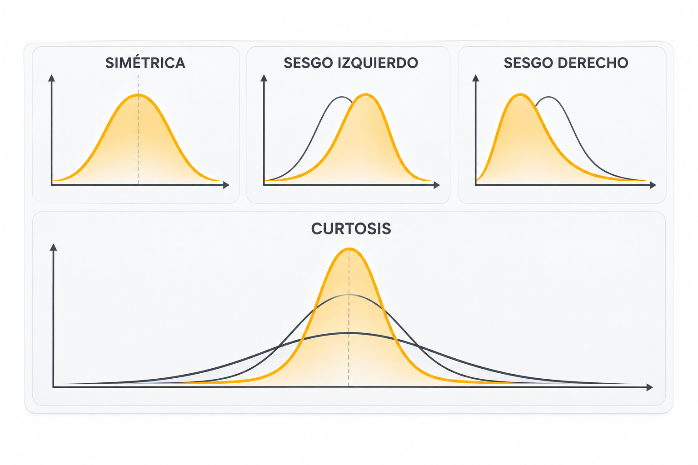
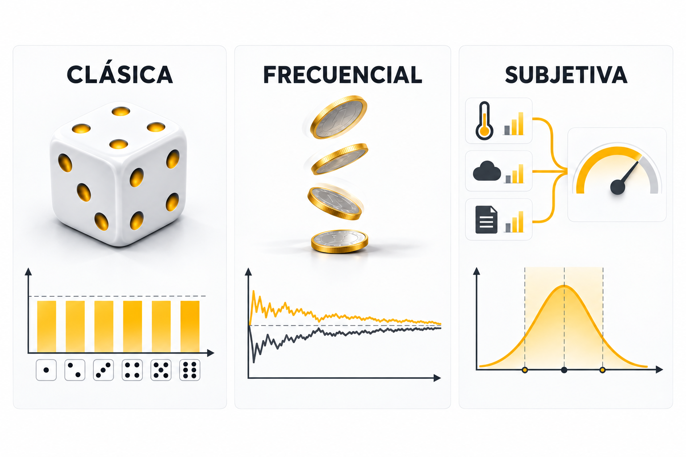
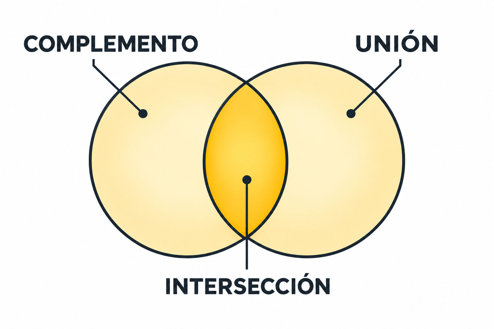
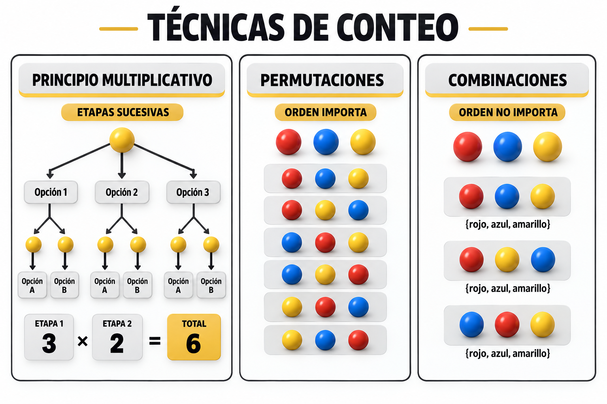
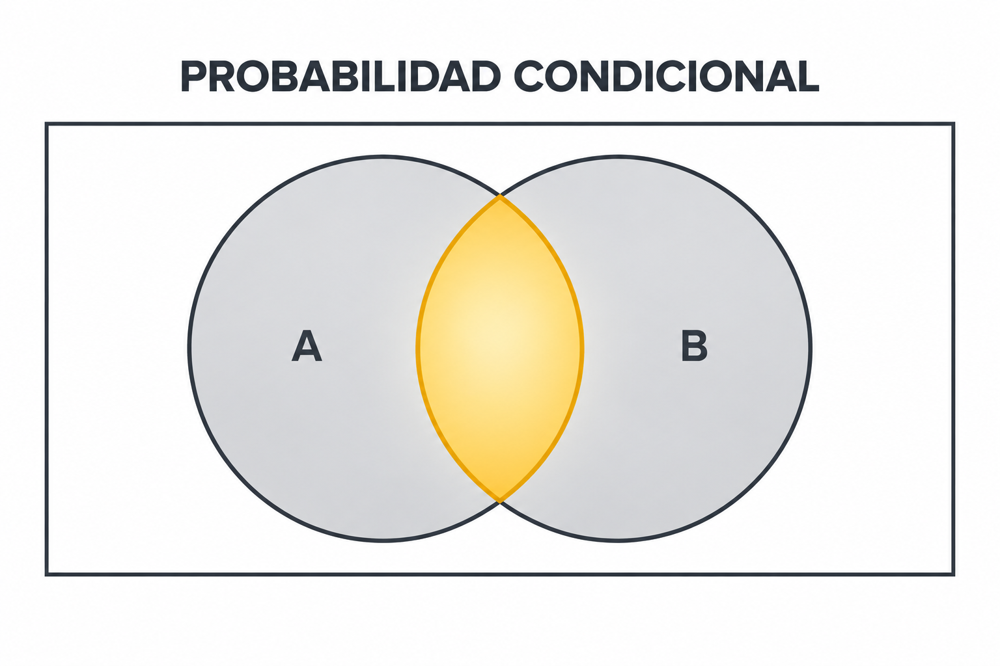
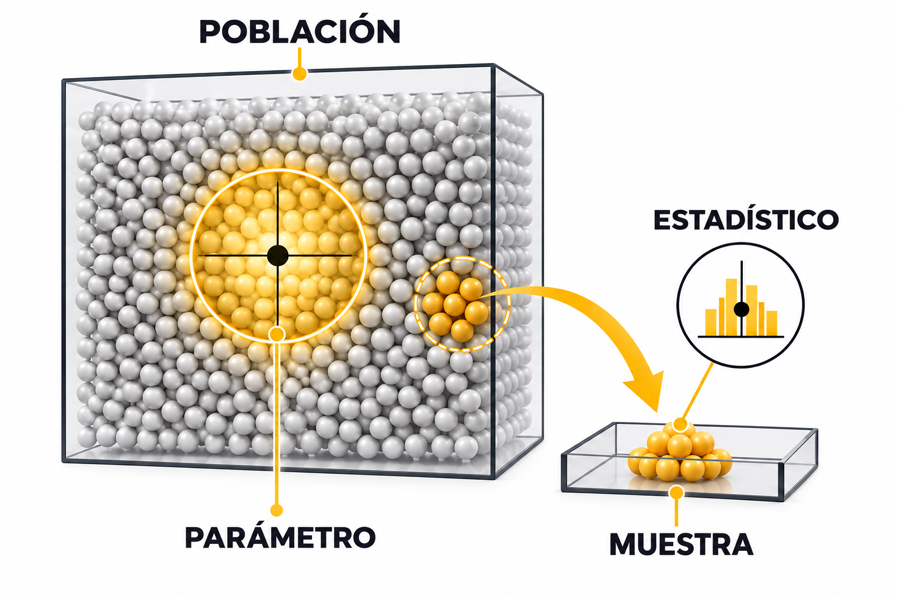
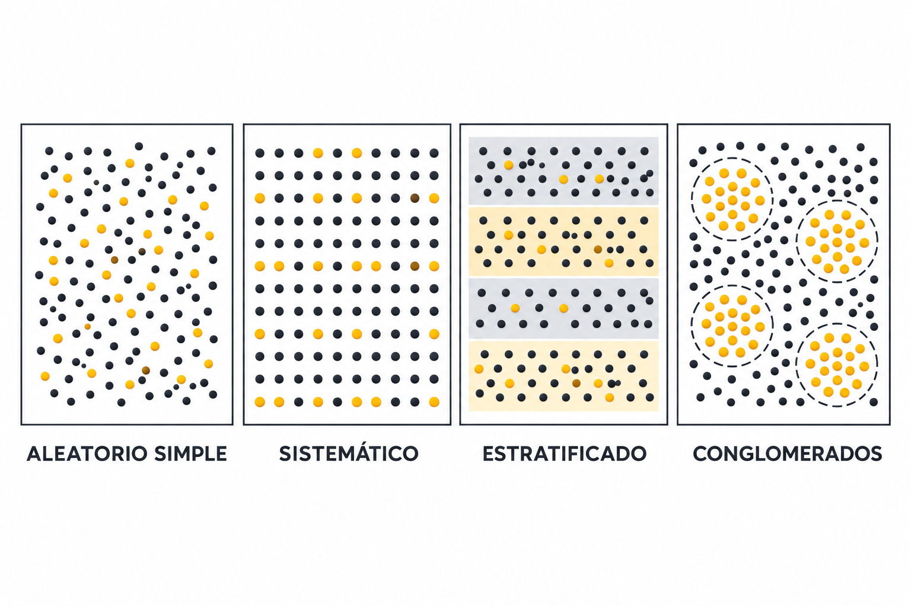
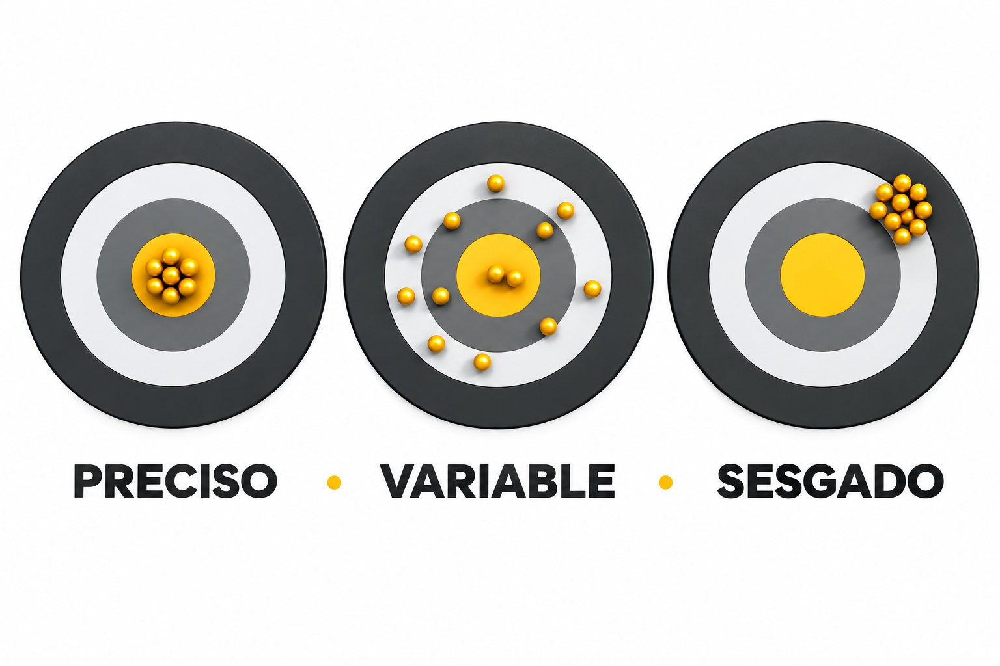
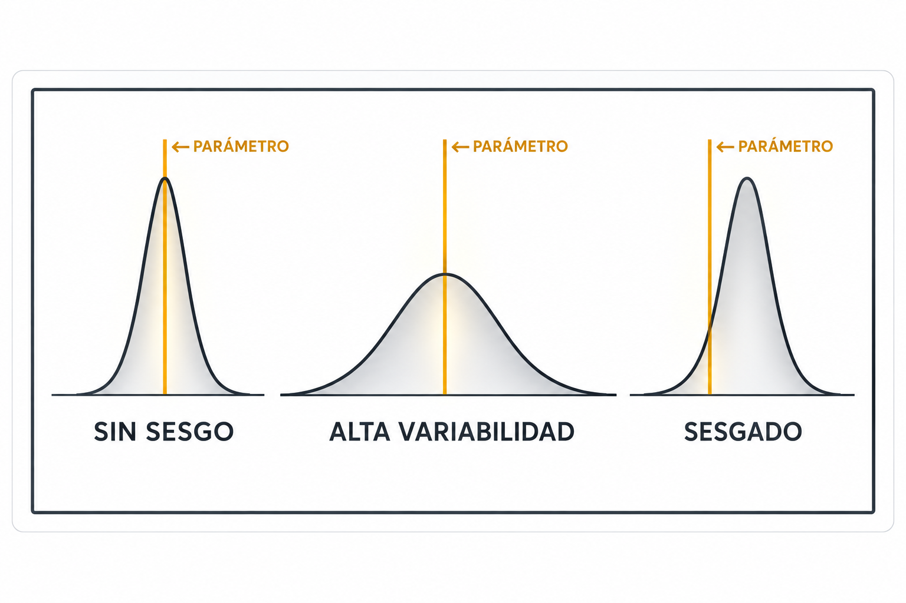
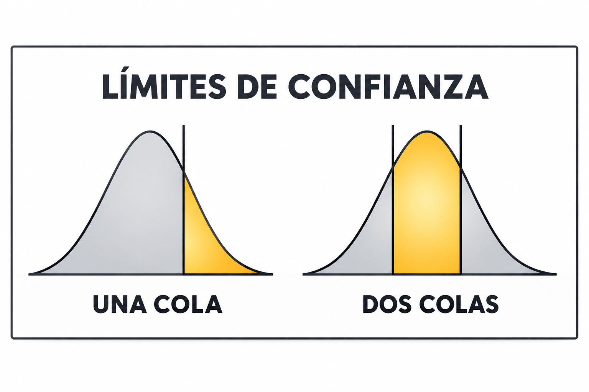

---

title: Fundamentos de la Estadística

order: 1

---

# Unidad 1. Fundamentos de la Estadística

# A. Estadística descriptiva

### 1. Introducción a la estadística descriptiva

La estadística descriptiva comprende métodos para recopilar, organizar, resumir y presentar datos. Su finalidad es describir las características observadas de un conjunto de datos mediante tablas, gráficos y medidas numéricas, sin realizar inferencias sobre una población más amplia.


### 2. Distribuciones de frecuencia

Una distribución de frecuencia organiza los valores de una variable indicando cuántas observaciones corresponden a cada valor o intervalo. Puede expresarse mediante frecuencias absolutas, relativas y acumuladas.

Las frecuencias principales pueden expresarse como:

$
f_i=\text{número de observaciones en la categoría o intervalo }i
$

$
h_i=\frac{f_i}{n}
$

$
F_i=\sum_{j=1}^{i}f_j
$

$
H_i=\sum_{j=1}^{i}h_j
$

donde $f_i$ es la frecuencia absoluta, $h_i$ la frecuencia relativa, $F_i$ la frecuencia absoluta acumulada, $H_i$ la frecuencia relativa acumulada y $n$ el número total de observaciones.

**Práctica en R:** Construir una distribución de frecuencias absoluta, relativa y acumulada a partir de un conjunto sencillo de observaciones.

```r

# Datos de ejemplo

datos <- c(1, 2, 2, 3, 3, 3, 4, 4, 5, 5)

# Frecuencia absoluta

f_abs <- table(datos)

# Frecuencia relativa

f_rel <- prop.table(f_abs)

# Frecuencia acumulada

f_acum <- cumsum(f_abs)

# Tabla de frecuencias

tabla_frecuencias <- data.frame(

  Valor = as.numeric(names(f_abs)),

  Frecuencia = as.vector(f_abs),

  Frecuencia_relativa = as.vector(f_rel),

  Frecuencia_acumulada = as.vector(f_acum)

)

tabla_frecuencias

```

La salida permite observar cómo un mismo conjunto de datos puede resumirse mediante diferentes tipos de frecuencia.

### 3. Medidas de tendencia central

Las medidas de tendencia central representan un valor alrededor del cual se concentra un conjunto de datos. Las principales son la media aritmética, la mediana y la moda. Su utilidad depende de la distribución de los datos y de la presencia de valores extremos.

La media aritmética muestral se define como:

$
\bar{x}=\frac{1}{n}\sum_{i=1}^{n}x_i
$

Para datos ordenados $x_{(1)}\leq x_{(2)}\leq\cdots\leq x_{n}$, la mediana es:

$
\tilde{x}=
\begin{cases}
x_{\left(\frac{n+1}{2}\right)}, & \text{si } n \text{ es impar},\\[8pt]
\dfrac{x_{\left(\frac{n}{2}\right)}+x_{\left(\frac{n}{2}+1\right)}}{2}, & \text{si } n \text{ es par}.
\end{cases}
$

La moda corresponde al valor con mayor frecuencia:


**Práctica en R:** Calcular y comparar la media, la mediana y la moda de un conjunto de datos.

```r

datos <- c(2, 3, 3, 4, 5, 6, 20)

# Media

mean(datos)

# Mediana

median(datos)

# Moda

frecuencias <- table(datos)

moda <- as.numeric(names(frecuencias)[which.max(frecuencias)])

moda

```

Se puede modificar el valor extremo `20` para observar cómo responde cada medida y reconocer que la media es más sensible a valores extremos que la mediana y la moda.

### 4. Medidas de dispersión

Las medidas de dispersión cuantifican cuánto varían los datos alrededor de un valor central. Entre las principales se encuentran rango, varianza, desviación estándar y coeficiente de variación. Una mayor dispersión indica mayor heterogeneidad de las observaciones.

El rango se calcula mediante:

$
R=x_{\max}-x_{\min}
$

La varianza muestral es:

$
s^2=\frac{\sum_{i=1}^{n}(x_i-\bar{x})^2}{n-1}
$

y la desviación estándar muestral:

$
s=\sqrt{s^2}
$

El coeficiente de variación, útil para expresar la dispersión relativa, es:

$
CV=\frac{s}{\bar{x}}\times 100%
$

**Práctica en R:** Comparar dos conjuntos de datos con medias similares pero diferente dispersión.

```r

grupo_A <- c(48, 49, 50, 50, 51, 52)

grupo_B <- c(20, 35, 45, 55, 65, 80)

# Medias

mean(grupo_A)

mean(grupo_B)

# Rango

diff(range(grupo_A))

diff(range(grupo_B))

# Varianza

var(grupo_A)

var(grupo_B)

# Desviación estándar

sd(grupo_A)

sd(grupo_B)

# Diagramas de caja

boxplot(

  grupo_A, grupo_B,

  names = c("Grupo A", "Grupo B"),

  ylab = "Valores",

  main = "Comparación de la dispersión"

)

```

El ejercicio permite comprobar que dos conjuntos pueden presentar centros semejantes y, al mismo tiempo, grados muy diferentes de variabilidad.

### 5. Medidas de forma

Las medidas de forma describen características de una distribución que no quedan reflejadas únicamente por su centro y dispersión. La asimetría indica el grado y dirección de falta de simetría, mientras que la curtosis describe características relacionadas con la concentración y las colas de la distribución.

Una forma basada en momentos para medir la asimetría es:

$
g_1=\frac{\frac{1}{n}\sum_{i=1}^{n}(x_i-\bar{x})^3}{s^3}
$

y una medida de curtosis basada en el cuarto momento es:

$
g_2=\frac{\frac{1}{n}\sum_{i=1}^{n}(x_i-\bar{x})^4}{s^4}
$

Con esta última definición, una distribución normal tiene curtosis cercana a (3). Si se utiliza exceso de curtosis, se resta 3:

$
g_2^{(\text{exceso})}=g_2-3
$



**Práctica en R:** Calcular la asimetría y la curtosis de un conjunto de datos sin paquetes adicionales.

```r

datos <- c(2, 3, 3, 4, 5, 6, 8, 12)

n <- length(datos)

media <- mean(datos)

s <- sd(datos)

# Asimetría aproximada

asimetria <- mean((datos - media)^3) / s^3

# Curtosis aproximada

curtosis <- mean((datos - media)^4) / s^4

asimetria

curtosis

hist(datos,

     main = "Forma de la distribución",

     xlab = "Valores")

```    

### 6. Uso de software estadístico

El software estadístico permite procesar conjuntos de datos y obtener automáticamente tablas, gráficos y estadísticos descriptivos. Su uso adecuado requiere seleccionar las variables y procedimientos correctos e interpretar los resultados en función del problema analizado.

**Práctica en R:** Realizar un análisis descriptivo básico utilizando un conjunto de datos incluido en R.

```r

# Cargar datos

data(mtcars)

# Examinar las primeras observaciones

head(mtcars)

# Resumen estadístico

summary(mtcars)

# Media y desviación estándar del rendimiento

mean(mtcars$mpg)

sd(mtcars$mpg)

# Histograma

hist(

  mtcars$mpg,

  main = "Distribución del rendimiento",

  xlab = "Millas por galón"

)

# Diagrama de caja

boxplot(

  mtcars$mpg,

  main = "Rendimiento de los automóviles",

  ylab = "Millas por galón"

)

```

La actividad permite distinguir entre el cálculo automático realizado por el software y la interpretación estadística que debe realizar el estudiante.

---

# B. Probabilidad

### 1. Introducción a la probabilidad

La probabilidad proporciona un marco matemático para cuantificar la incertidumbre asociada con fenómenos aleatorios. A cada evento se le asigna un valor entre 0 y 1, donde 0 representa imposibilidad y 1 certeza.

Para cualquier evento (A):

$
0\leq P(A)\leq 1
$

y para el espacio muestral (\Omega):

$
P(\Omega)=1
$


**Práctica en R:** Simular el lanzamiento de una moneda y estimar la probabilidad de obtener cara.

```r

lanzamientos <- sample(

  c("Cara", "Cruz"),

  size = 1000,

  replace = TRUE

)

table(lanzamientos)

prop.table(table(lanzamientos))

# Probabilidad experimental de cara

mean(lanzamientos == "Cara")

```

### 2. Tipos de probabilidad

La probabilidad puede establecerse mediante diferentes enfoques. El enfoque clásico utiliza resultados igualmente posibles; el frecuencial se basa en la frecuencia relativa observada después de numerosas repeticiones; y el subjetivo representa un grado de creencia sustentado en información disponible.

En el enfoque clásico, si todos los resultados son equiprobables:

$
P(A)=\frac{|A|}{|\Omega|}
$

En el enfoque frecuencial, la probabilidad se interpreta mediante el comportamiento de la frecuencia relativa cuando aumenta el número de repeticiones:

$
P(A)\approx \frac{n_A}{n},
\qquad
P(A)=\lim_{n\to\infty}\frac{n_A}{n}
$

cuando dicho límite existe.



**Práctica en R:** Comparar una probabilidad clásica con una estimación frecuencial.

```r

# Probabilidad clásica de obtener un 6 en un dado

p_clasica <- 1 / 6

p_clasica

# Probabilidad frecuencial mediante simulación

dados <- sample(1:6, size = 10000, replace = TRUE)

p_frecuencial <- mean(dados == 6)

p_frecuencial

```

### 3. Propiedades de la probabilidad

Las probabilidades cumplen reglas fundamentales: nunca son negativas, la probabilidad del espacio muestral es 1 y las probabilidades de eventos pueden combinarse mediante reglas como complemento, adición y multiplicación, dependiendo de la relación existente entre los eventos.

Regla del complemento:

$
P(A^c)=1-P(A)
$

Regla general de adición:

$
P(A\cup B)=P(A)+P(B)-P(A\cap B)
$

Si (A) y (B) son mutuamente excluyentes:

$
P(A\cup B)=P(A)+P(B)
$

Regla de multiplicación:

$
P(A\cap B)=P(A),P(B\mid A)
$

Si (A) y (B) son independientes:

$
P(A\cap B)=P(A)P(B)
$




> ## Ejemplo
> En una caja hay 10 figuras en total:
> * 4 bolas rojas
> * 2 bolas azules
> * 1 cuadro rojo
> * 3 cuadros azules.
>
> Se selecciona una figura al azar de la caja.
>
> 1. Calcula:
>
> a) La posibilidad de seleccionar una figura que no sea una bola roja.
>
> b) La posibilidad de seleccionar una bola roja o una figura azul.
>
> c) La posibilidad de extraer primero un cuadro rojo y, sin devolverlo a la caja, extraer una bola azul en la segunda selección.
>
> ```r
># Crear la caja con 10 figuras
> figura <- c(
>   "bola", "bola", "bola", "bola",   # 4 bolas rojas
>   "bola", "bola",                   # 2 bolas azules
>   "cuadro",                         # 1 cuadro rojo
>   "cuadro", "cuadro", "cuadro"     # 3 cuadros azules
> )
>
> color <- c(
>   "rojo", "rojo", "rojo", "rojo",
>   "azul", "azul",
>   "rojo",
>   "azul", "azul", "azul"
> )
>
> # Llenar la caja
> caja <- data.frame(figura, color)
>
> # Mostrar el contenido de la caja
> caja
>
> # A = sacar una bola roja
> > A <- caja$figura == "bola" & caja$color == "rojo"
>
> # Probabilidad de A
> p_A <- sum(A) / nrow(caja)
> p_A
>
> # Complemento de A: No sacar una bola roja
> p_no_A <- 1 - p_A
> p_no_A
>
> > # B = sacar una figura azul
> B <- caja$color == "azul"
>
> # Probabilidad de B
> p_B <- sum(B) / nrow(caja)
> p_B
>
>
> # Unión de A y B: Bola roja O figura azul
> p_A_union_B <- sum(A | B) / nrow(caja)
> p_A_union_B
> ```

### 4. Técnicas de conteo

Las técnicas de conteo determinan el número de resultados posibles sin necesidad de enumerarlos individualmente. El principio multiplicativo, las permutaciones y las combinaciones permiten resolver diferentes situaciones dependiendo de si existen etapas sucesivas y de si el orden de selección importa.

Si un procedimiento tiene $k$ etapas con $n_1,n_2,\ldots,n_k$ posibilidades, el principio multiplicativo establece:

$
N=n_1n_2\cdots n_k=\prod_{i=1}^{k}n_i
$

El factorial de $n$ es:

$
n!=n(n-1)(n-2)\cdots 2\cdot1
$

Las permutaciones de $n$ elementos tomados de $r$ en $r$ son:

$
P(n,r)=\frac{n!}{(n-r)!}
$

y las combinaciones son:

$
\binom{n}{r}=\frac{n!}{r!(n-r)!}
$



**Práctica en R:** Comparar permutaciones y combinaciones mediante funciones matemáticas disponibles en R.

```r

# Factorial

factorial(5)

# Número de formas de ordenar 3 elementos tomados de un grupo de 5

permutaciones <- factorial(5) / factorial(5 - 3)

permutaciones

# Número de formas de seleccionar 3 elementos de un grupo de 5

combinaciones <- choose(5, 3)

combinaciones

```

La comparación permite observar directamente el efecto que tiene considerar o no el orden de los elementos.

### 5. Probabilidad condicional

La probabilidad condicional representa la probabilidad de que ocurra un evento cuando se sabe que otro ya ocurrió. La información previa restringe el espacio de resultados relevantes y puede modificar la probabilidad originalmente asignada.

Para (P(B)>0):

$
P(A\mid B)=\frac{P(A\cap B)}{P(B)}
$

De manera equivalente:

$
P(A\cap B)=P(A\mid B)P(B)
$



**Práctica en R:** Calcular una probabilidad condicional a partir de una tabla de contingencia.

```r

tabla <- matrix(

  c(30, 20,

    10, 40),

  nrow = 2,

  byrow = TRUE,

  dimnames = list(

    Resultado = c("A", "No_A"),

    Condicion = c("B", "No_B")

  )

)

tabla

# P(A | B)

p_A_dado_B <- tabla["A", "B"] / sum(tabla[, "B"])

p_A_dado_B

```

### 6. Teorema de Bayes

El teorema de Bayes permite actualizar la probabilidad de una hipótesis cuando aparece nueva evidencia. Combina una probabilidad previa con la probabilidad de observar la evidencia bajo diferentes hipótesis para obtener una probabilidad posterior.

Para una hipótesis (H) y evidencia (E):

$
P(H\mid E)=\frac{P(E\mid H)P(H)}{P(E)}
$

Si se consideran (H) y su complemento (H^c), la probabilidad total de la evidencia es:

$
P(E)=P(E\mid H)P(H)+P(E\mid H^c)P(H^c)
$

por lo que:

$
P(H\mid E)=
\frac{P(E\mid H)P(H)}{P(E\mid H)P(H)+P(E\mid H^c)P(H^c)}
$


> ## Ejemplo
> Una enfermedad poco común afecta al 1% de la población. Para detectarla se utiliza una prueba médica.
>
> La prueba tiene las siguientes características:
>
> Si una persona tiene la enfermedad, la prueba da un resultado positivo en el 95% de los casos.
> Si una persona no tiene la enfermedad, la prueba da un resultado positivo en el 5% de los casos.
>
> Una persona seleccionada al azar se realiza la prueba y obtiene un resultado positivo.
>
> Pregunta:
> ¿Cuál es la probabilidad de que la persona realmente tenga la enfermedad dado que obtuvo un resultado positivo?
>
> Utiliza el Teorema de Bayes para determinar la probabilidad posterior.
>
> ```r
> # Probabilidad previa de una condición
> p_H <- 0.01
>
> # Probabilidad de evidencia si la condición está presente
> p_E_dado_H <- 0.95
>
> # Probabilidad de evidencia si la condición no está presente
> p_E_dado_noH <- 0.05
>
> # Probabilidad total de la evidencia
> p_E <- p_E_dado_H * p_H +
>        p_E_dado_noH * (1 - p_H)
>
> # Probabilidad posterior
> p_H_dado_E <- (p_E_dado_H * p_H) / p_E
> p_H_dado_E
> ```

### 7. Distribuciones discretas de probabilidad

Una distribución discreta asigna probabilidades a valores separados y contables de una variable aleatoria. La suma de las probabilidades de todos sus valores posibles debe ser igual a 1. Entre los modelos más utilizados se encuentran las distribuciones binomial y de Poisson.

Para una variable aleatoria discreta $X$ con función de probabilidad $p(x)$:

$
p(x)=P(X=x),\qquad p(x)\geq 0
$

$
\sum_x p(x)=1
$

La distribución binomial $X\sim\operatorname{Bin}(n,p)$ tiene función de probabilidad:

$
P(X=x)=\binom{n}{x}p^x(1-p)^{n-x},
\qquad x=0,1,\ldots,n
$

con:

$
E(X)=np,\qquad \operatorname{Var}(X)=np(1-p)
$

Para $X\sim\operatorname{Poisson}(\lambda)$:

$
P(X=x)=\frac{e^{-\lambda}\lambda^x}{x!},
\qquad x=0,1,2,\ldots
$

y:

$
E(X)=\operatorname{Var}(X)=\lambda
$

**Práctica en R:** Construir y representar una distribución binomial.

```r

# Número de éxitos posibles

x <- 0:10

# Distribución binomial:

# 10 ensayos y probabilidad de éxito de 0.5

probabilidades <- dbinom(x, size = 10, prob = 0.5)

# Verificar que las probabilidades suman 1

sum(probabilidades)

# Representación gráfica

barplot(

  probabilidades,

  names.arg = x,

  xlab = "Número de éxitos",

  ylab = "Probabilidad",

  main = "Distribución binomial"

)

```

El gráfico permite identificar que la variable solamente puede adoptar determinados valores enteros.

### 8. Distribuciones continuas de probabilidad

Una variable aleatoria continua puede adoptar cualquier valor dentro de un intervalo. Sus probabilidades se representan mediante áreas bajo una función de densidad, por lo que la probabilidad correspondiente a un valor individual es cero. La distribución normal constituye uno de los modelos continuos fundamentales.

Para una variable continua con función de densidad (f(x)):

$
f(x)\geq 0,
\qquad
\int_{-\infty}^{\infty}f(x),dx=1
$

La probabilidad de un intervalo es:

$
P(a\leq X\leq b)=\int_a^b f(x),dx
$

y para un valor individual:

$
P(X=x)=0
$

Si (X\sim N(\mu,\sigma^2)), su densidad es:

$
f(x)=\frac{1}{\sigma\sqrt{2\pi}}
\exp\left[-\frac{(x-\mu)^2}{2\sigma^2}\right]
$

La estandarización se realiza mediante:

$
Z=\frac{X-\mu}{\sigma}
$

**Práctica en R:** Representar una distribución normal y calcular la probabilidad correspondiente a un intervalo.

```r

# Valores para representar la distribución

x <- seq(-4, 4, length.out = 500)

y <- dnorm(x)

# Curva normal

plot(

  x, y,

  type = "l",

  xlab = "x",

  ylab = "Densidad",

  main = "Distribución normal estándar"

)

# Probabilidad de obtener un valor entre -1 y 1

pnorm(1) - pnorm(-1)

```

La actividad permite relacionar el área bajo la curva con una probabilidad y diferenciarla de la altura de la función de densidad.

### 9. Uso de software estadístico

El software estadístico permite calcular probabilidades, cuantiles y valores asociados con diferentes distribuciones. Para emplearlo correctamente deben identificarse la distribución apropiada, sus parámetros y el evento cuya probabilidad se desea calcular.

**Práctica en R:** Explorar las principales funciones de R asociadas con distribuciones de probabilidad.

```r

# Probabilidad acumulada normal

pnorm(1.96)

# Cuantil de la distribución normal

qnorm(0.975)

# Probabilidad binomial

dbinom(5, size = 10, prob = 0.5)

# Probabilidad acumulada binomial

pbinom(5, size = 10, prob = 0.5)

# Generar valores aleatorios normales

rnorm(10, mean = 0, sd = 1)

```

Las familias de funciones `d`, `p`, `q` y `r` permiten obtener densidades o probabilidades, probabilidades acumuladas, cuantiles y números aleatorios, respectivamente.

---

# C. Distribuciones muestrales

### 1. Introducción

La inferencia estadística utiliza información obtenida de una muestra para estudiar una población. Para ello distingue entre parámetros, que describen características poblacionales, y estadísticos, que se calculan a partir de las observaciones de una muestra.



**Práctica en R:** Distinguir entre un parámetro poblacional y un estadístico muestral.

```r

# Población

poblacion <- rnorm(10000, mean = 50, sd = 10)

# Muestra

muestra <- sample(poblacion, size = 50)

# Parámetro poblacional

mean(poblacion)

# Estadístico muestral

mean(muestra)

```

### 2. Tipos de muestreo

Los métodos de muestreo determinan cómo se seleccionan las unidades de una población. Entre los métodos probabilísticos se encuentran el muestreo aleatorio simple, sistemático, estratificado y por conglomerados. La elección afecta la representatividad y las propiedades de las estimaciones.



**Práctica en R:** Obtener una muestra aleatoria simple y una muestra sistemática.

```r

poblacion <- 1:100

# Muestreo aleatorio simple

muestra_aleatoria <- sample(

  poblacion,

  size = 10,

  replace = FALSE

)

# Muestreo sistemático: seleccionar cada 10 elementos

inicio <- sample(1:10, size = 1)

muestra_sistematica <- seq(inicio, 100, by = 10)

muestra_aleatoria

muestra_sistematica

```

### 3. Distribución muestral

Una distribución muestral es la distribución de probabilidad de un estadístico obtenida al considerar todas las muestras posibles de determinado tamaño. Permite estudiar cómo varían estadísticos como la media o la proporción entre diferentes muestras.

Para la media muestral:

$
\bar{X}=\frac{1}{n}\sum_{i=1}^{n}X_i
$

si las observaciones son independientes y tienen media (\mu) y varianza (\sigma^2):

$
E(\bar{X})=\mu
$

$
\operatorname{Var}(\bar{X})=\frac{\sigma^2}{n}
$

Cuando la población es normal, o aproximadamente para muestras suficientemente grandes bajo las condiciones del teorema central del límite:

$
\bar{X}\approx N\left(\mu,\frac{\sigma^2}{n}\right)
$

**Práctica en R:** Simular numerosas muestras de una población y construir la distribución de sus medias.

```r

# Población

poblacion <- rnorm(10000, mean = 50, sd = 10)

# Obtener 1000 medias de muestras de tamaño 30

medias <- replicate(

  1000,

  mean(sample(poblacion, size = 30, replace = TRUE))

)

# Distribución de las medias muestrales

hist(

  medias,

  breaks = 30,

  main = "Distribución muestral de la media",

  xlab = "Media muestral"

)

# Comparar medias

mean(poblacion)

mean(medias)

```

La simulación permite observar directamente cómo un estadístico cambia de una muestra a otra y cómo esas variaciones forman una nueva distribución.

### 4. Error estándar

El error estándar mide la variabilidad de un estadístico entre muestras. En general, al aumentar el tamaño de la muestra disminuye el error estándar, haciendo que las estimaciones tiendan a concentrarse más cerca del parámetro poblacional.

Para la media muestral, si se conoce la desviación estándar poblacional:

$
SE(\bar{X})=\frac{\sigma}{\sqrt{n}}
$

Si $\sigma$ es desconocida y se utiliza la desviación estándar muestral:

$
\widehat{SE}(\bar{X})=\frac{s}{\sqrt{n}}
$

Para una proporción muestral:

$
SE(\hat{p})=\sqrt{\frac{p(1-p)}{n}}
$

y en la práctica suele estimarse mediante:

$
\widehat{SE}(\hat{p})=\sqrt{\frac{\hat{p}(1-\hat{p})}{n}}
$

**Práctica en R:** Comparar el error estándar asociado con diferentes tamaños de muestra.

```r

sigma <- 10

# Tamaños de muestra

n <- c(10, 30, 50, 100, 500)

# Error estándar de la media

error_estandar <- sigma / sqrt$n$

data.frame(

  Tamaño_muestra = n,

  Error_estandar = error_estandar

)

# Representación gráfica

plot(

  n, error_estandar,

  type = "b",

  xlab = "Tamaño de muestra",

  ylab = "Error estándar",

  main = "Tamaño muestral y error estándar"

)

```

El resultado muestra que el error estándar disminuye conforme aumenta el tamaño de la muestra.

### 5. Uso de software estadístico

El software permite generar muestras, simular distribuciones muestrales y calcular errores estándar. Estas simulaciones facilitan la comprensión de conceptos que implican la repetición hipotética del proceso de muestreo.

**Práctica en R:** Comparar mediante simulación las distribuciones muestrales obtenidas con diferentes tamaños de muestra.

```r

# Población

poblacion <- rnorm(10000, mean = 100, sd = 20)

# Función para simular medias

simular_medias <- function(n, repeticiones = 1000) {

  replicate(

    repeticiones,

    mean(sample(poblacion, size = n, replace = TRUE))

  )

}

medias_10  <- simular_medias(10)

medias_50  <- simular_medias(50)

medias_200 <- simular_medias(200)

# Desviación estándar de las distribuciones muestrales

sd(medias_10)

sd(medias_50)

sd(medias_200)

```

La comparación permite comprobar experimentalmente que las medias muestrales presentan menor variabilidad conforme aumenta el tamaño de la muestra.

---

# D. Estimación de errores

### 1. Introducción

Debido a la variabilidad muestral, un estadístico normalmente no coincide exactamente con el parámetro poblacional. La estimación estadística busca utilizar información de la muestra para aproximar parámetros desconocidos y expresar la incertidumbre asociada con esa aproximación.




### 2. Estimación estadística

Un estimador es una regla o estadístico empleado para aproximar un parámetro poblacional. La calidad de un estimador puede analizarse mediante propiedades como insesgamiento, consistencia y eficiencia.

Un estimador $\hat{\theta}$ es insesgado para $\theta$ si:

$
E(\hat{\theta})=\theta
$

Su sesgo se define como:

$
\operatorname{Sesgo}(\hat{\theta})=E(\hat{\theta})-\theta
$

y su error cuadrático medio como:

$
ECM(\hat{\theta})
=E\left[(\hat{\theta}-\theta)^2\right]
=\operatorname{Var}(\hat{\theta})
+\operatorname{Sesgo}(\hat{\theta})^2
$



**Práctica en R:** Examinar el comportamiento de la media muestral como estimador de la media poblacional.

```r

mu <- 100

sigma <- 15

estimaciones <- replicate(

  1000,

  mean(rnorm(30, mean = mu, sd = sigma))

)

mean(estimaciones)

sd(estimaciones)

hist(estimaciones,

     main = "Distribución de estimaciones",

     xlab = "Media muestral")

 ```    

### 3. Estimación puntual

Una estimación puntual utiliza un único valor calculado a partir de la muestra como aproximación del parámetro poblacional. Por ejemplo, la media muestral puede utilizarse como estimación puntual de la media poblacional.

De forma general:

$
\hat{\theta}=T(X_1,X_2,\ldots,X_n)
$

Por ejemplo, para estimar la media poblacional:

$
\hat{\mu}=\bar{x}=\frac{1}{n}\sum_{i=1}^{n}x_i
$

y para estimar una proporción poblacional:

$
\hat{p}=\frac{x}{n}
$

donde (x) es el número de observaciones con la característica de interés.

**Práctica en R:** Obtener estimaciones puntuales a partir de una muestra.

```r

muestra <- c(18, 21, 20, 23, 19, 22, 24, 20)

# Estimación puntual de la media poblacional

media_estimada <- mean(muestra)

# Estimación puntual de la desviación estándar

sd_estimada <- sd(muestra)

media_estimada

sd_estimada

```

Los resultados constituyen valores únicos utilizados para aproximar parámetros desconocidos de la población.

### 4. Estimación por intervalos de confianza

Un intervalo de confianza proporciona un rango de valores plausibles para un parámetro mediante un procedimiento que, bajo muestreo repetido, produce intervalos que contienen el parámetro con una frecuencia determinada por el nivel de confianza. Su amplitud depende, entre otros factores, de la variabilidad, el tamaño muestral y el nivel de confianza.

La forma general de un intervalo de confianza es:

$
\text{estimación}\pm
(\text{valor crítico})(\text{error estándar})
$

Para una media con (\sigma) conocida:

$
\bar{x}\pm z_{\alpha/2}\frac{\sigma}{\sqrt{n}}
$

Cuando (\sigma) es desconocida y se estima con (s):

$
\bar{x}\pm t_{\alpha/2,n-1}\frac{s}{\sqrt{n}}
$

El margen de error es:

$
E=(\text{valor crítico})(\text{error estándar})
$

**Práctica en R:** Calcular un intervalo de confianza para una media poblacional.

```r

muestra <- c(18, 21, 20, 23, 19, 22, 24, 20)

# Intervalo de confianza para la media

t.test(muestra, conf.level = 0.95)

```

Para reforzar la interpretación frecuentista, puede complementarse la actividad generando repetidamente muestras y observando qué proporción de sus intervalos contiene el verdadero parámetro.

### 5. Estimación de la diferencia entre dos medias

Cuando se comparan dos poblaciones cuantitativas, puede estimarse la diferencia entre sus medias mediante la diferencia observada entre las medias muestrales. Un intervalo de confianza permite expresar la incertidumbre de dicha diferencia.

La estimación puntual es:

$
\widehat{\mu_1-\mu_2}=\bar{x}_1-\bar{x}_2
$

Para muestras independientes, un error estándar habitual de la diferencia es:

$
\sqrt{\frac{s_1^2}{n_1}+\frac{s_2^2}{n_2}}
$

El intervalo de confianza de Welch tiene la forma:

$
(\bar{x}_1-\bar{x}2)
\pm
t{\alpha/2,\nu}
\sqrt{\frac{s_1^2}{n_1}+\frac{s_2^2}{n_2}}
$

donde (\nu) representa los grados de libertad aproximados de Welch.

**Práctica en R:** Estimar la diferencia entre dos medias y obtener su intervalo de confianza.

```r

grupo_A <- c(72, 75, 78, 74, 77, 80, 76, 79)

grupo_B <- c(68, 70, 71, 69, 73, 72, 70, 74)

# Diferencia observada entre medias

mean(grupo_A) - mean(grupo_B)

# Intervalo de confianza para la diferencia

t.test(grupo_A, grupo_B, conf.level = 0.95)

```

El ejercicio permite pasar de una diferencia puntual observada a una estimación que incorpora la incertidumbre muestral.

### 6. Estimación de la diferencia entre dos proporciones

Para comparar poblaciones respecto de una característica binaria se utilizan las proporciones muestrales. La diferencia entre ellas sirve como estimador de la diferencia entre las proporciones poblacionales, mientras que un intervalo permite incorporar la incertidumbre muestral.

Para cada grupo:

$
\hat{p}_1=\frac{x_1}{n_1},
\qquad
\hat{p}_2=\frac{x_2}{n_2}
$

La diferencia estimada es:

$
\widehat{p_1-p_2}=\hat{p}_1-\hat{p}_2
$

Un error estándar no combinado para construir un intervalo es:

$
\sqrt{
\frac{\hat{p}_1(1-\hat{p}_1)}{n_1}
+
\frac{\hat{p}_2(1-\hat{p}_2)}{n_2}
}
$

y una aproximación normal del intervalo es:

$
(\hat{p}_1-\hat{p}2)
\pm
z{\alpha/2},
SE(\hat{p}_1-\hat{p}_2)
$

**Práctica en R:** Comparar dos proporciones muestrales y obtener un intervalo de confianza.

```r

# Éxitos observados

exitos <- c(65, 50)

# Tamaños de muestra

n <- c(100, 100)

# Proporciones observadas

proporciones <- exitos / n

proporciones

# Diferencia entre proporciones

proporciones[1] - proporciones[2]

# Comparación e intervalo de confianza

prop.test(exitos, n, conf.level = 0.95, correct = FALSE)

```

La actividad permite relacionar las proporciones observadas con la incertidumbre asociada con la diferencia entre poblaciones.

### 7. Límites de confianza de una cola

Un límite de confianza unilateral establece solamente una frontera inferior o superior para un parámetro. Se utiliza cuando el problema requiere determinar, con un nivel de confianza específico, que el parámetro se encuentra por encima o por debajo de cierto límite.

Para una media con desviación estándar poblacional desconocida, un límite inferior unilateral es:

$
L=\bar{x}-t_{\alpha,n-1}\frac{s}{\sqrt{n}}
$

y un límite superior unilateral es:

$
U=\bar{x}+t_{\alpha,n-1}\frac{s}{\sqrt{n}}
$

A diferencia de un intervalo bilateral, el valor crítico corresponde a (\alpha), no a (\alpha/2).



**Práctica en R:** Obtener límites de confianza unilaterales para una media.

```r

muestra <- c(18, 21, 20, 23, 19, 22, 24, 20)

# Límite inferior unilateral al 95 %

t.test(

  muestra,

  conf.level = 0.95,

  alternative = "greater"

)$conf.int

# Límite superior unilateral al 95 %

t.test(

  muestra,

  conf.level = 0.95,

  alternative = "less"

)$conf.int

```

### 8. Selección del tamaño muestral

El tamaño muestral necesario depende de la precisión requerida, el nivel de confianza, la variabilidad esperada y el parámetro que se desea estimar. En términos generales, exigir un menor margen de error o un mayor nivel de confianza requiere muestras más grandes.

Para estimar una media con desviación estándar poblacional esperada (\sigma) y margen de error (E):

$
n=
\left(
\frac{z_{\alpha/2}\sigma}{E}
\right)^2
$

El resultado debe redondearse hacia arriba:

$
n_{\text{final}}=
\left\lceil
\left(
\frac{z_{\alpha/2}\sigma}{E}
\right)^2
\right\rceil
$

Para estimar una proporción con margen de error (E):

$
n=
\frac{z_{\alpha/2}^2p(1-p)}{E^2}
$

Si no existe una estimación previa de (p), puede utilizarse (p=0.5), que produce el tamaño muestral más conservador:

$
n=
\frac{z_{\alpha/2}^2(0.25)}{E^2}
$

**Práctica en R:** Calcular el tamaño de muestra requerido para estimar una media con un margen de error determinado.

```r

# Parámetros del problema

sigma <- 10       # Desviación estándar esperada

E <- 2            # Margen de error deseado

confianza <- 0.95 # Nivel de confianza

# Valor crítico

alpha <- 1 - confianza

z <- qnorm(1 - alpha / 2)

# Tamaño muestral requerido

n <- (z * sigma / E)^2

# Redondear hacia arriba

ceiling$n$

```

También puede analizarse cómo cambia el tamaño requerido cuando se modifica el margen de error.

```r

margenes <- c(5, 4, 3, 2, 1)

n_requerido <- ceiling(

  (z * sigma / margenes)^2

)

data.frame(

  Margen_error = margenes,

  Tamaño_muestra = n_requerido

)

```

La comparación permite observar de manera cuantitativa que exigir mayor precisión, es decir, un margen de error menor, requiere incrementar el tamaño de la muestra.